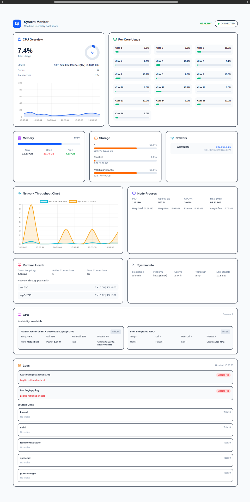

# داشبورد پایش لحظه‌ای سیستم

یک اپلیکیشن دسکتاپ برای تله‌متری لحظه‌ای سیستم که با **Node.js +
Socket.IO + Tailwind CSS + Chart.js** ساخته شده است. این برنامه CPU، حافظه،
دیسک، شبکه، GPU، سلامت پردازه‌ها و لاگ‌های سیستم را پایش می‌کند — و همه این
داده‌ها را به‌صورت زنده از طریق WebSocket به یک رابط کاربری واکنش‌گرا در مرورگر
ارسال می‌کند.

## ویژگی‌ها

| ویژگی                 | توضیحات                                                                                               |
| --------------------- | ----------------------------------------------------------------------------------------------------- |
| **پایش CPU**          | درصد استفاده کلی، نمایشگر شعاعی، نمودار میله‌ای برای هر هسته، نمودار خطی زنده                         |
| **شاخص‌های حافظه**    | حافظه کل / استفاده‌شده / آزاد به‌همراه نوار پیشرفت و درصد استفاده                                     |
| **استفاده از دیسک**   | فضای ذخیره‌سازی برای هر mount به‌همراه نوار پیشرفت (Linux `df`، macOS `df`، Windows PowerShell)       |
| **رابط‌های شبکه**     | تشخیص IPv4 / IPv6، فیلتر کردن رابط‌های مجازی                                                          |
| **توان عملیاتی شبکه** | RX/TX زنده برحسب KB/s برای هر رابط همراه با نمودار سری زمانی (`/proc/net/dev`، `netstat`، PowerShell) |
| **شاخص‌های GPU**      | پایش GPU: دما، میزان استفاده، حافظه، توان مصرفی، سرعت فن، فرکانس‌ها                                   |
| **پردازه Node**       | PID، مدت اجرا، CPU%، RSS، heap، حافظه external، array buffers                                         |
| **سلامت زمان اجرا**   | تأخیر event loop (نمونه‌برداری هر 500ms)، تعداد اتصال‌های فعال/کل WebSocket                           |
| **اطلاعات سیستم**     | نام میزبان، پلتفرم، مدت روشن بودن سیستم، پوشه موقت                                                    |
| **لاگ‌ها و ژورنال**   | دنبال کردن فایل‌های لاگ سیستم + واحدهای `journalctl` در لینوکس، جمع‌آوری لاگ به‌صورت چندسکویی         |
| **وضعیت سلامت**       | محاسبه خودکار HEALTHY / WARNING / CRITICAL بر اساس آستانه‌های CPU، حافظه، دیسک و event loop           |

---

## 📸 پیش‌نمایش داشبورد



---

## پشته فناوری

**فرانت‌اند**

- جاوااسکریپت خام (ES Modules)
- Vite
- Tailwind CSS v4
- Chart.js (برای تاریخچه CPU و نمودارهای خطی توان عملیاتی شبکه)
- Socket.IO Client
- Lucide Icons
- Toastify.js

**بک‌اند**

- Node.js + Express
- Socket.IO (با بازه پخش 1 ثانیه‌ای)
- ماژول `os` برای شاخص‌های سیستم
- `nvidia-smi` برای شاخص‌های GPU (اختیاری)
- `journalctl` / `tail` برای جمع‌آوری لاگ
- Mongoose (آماده برای ذخیره‌سازی اختیاری)

## ساختار پروژه
```
realtime_system_monitoring/
├── front/                    # Vite + Tailwind frontend
│   ├── index.html
│   ├── vite.config.ts
│   └── assets/
│       ├── css/style.css
│       └── js/script.js      # Single-file SPA logic
├── back/                     # Express + Socket.IO backend
│   ├── .env                  # PORT & clientOrigin config
│   └── src/
│       ├── server.js          # Entry point
│       ├── app.js             # Express app
│       ├── configs/
│       │   ├── socket.js      # Socket.IO server + 1s broadcast
│       │   └── db.js          # MongoDB connection (optional)
│       ├── controllers/
│       │   └── monitoring/
│       │       └── monitoring.controller.js
│       └── utils/monitoring/
│           ├── cpu.js         # Delta-based CPU usage calculation
│           ├── memory.js      # System + process memory
│           ├── disk.js        # Cross-platform disk usage
│           ├── network.js     # Interfaces + throughput
│           ├── gpu.js         # NVIDIA GPU via nvidia-smi
│           ├── logs.js        # Log files + journalctl
│           ├── process.js     # Node.js process metrics
│           ├── eventLoop.js   # Event loop lag measurement
│           ├── connections.js # WebSocket connection tracking
│           ├── resourceUsage.js
│           └── system.js      # Static system info
├── images/
├── package.json              # Root scripts (setup, start)
├── LICENSE
└── README.md
```


## شروع کار

### پیش‌نیازها

- Node.js >= 18
- npm
- (اختیاری) کارت گرافیک NVIDIA به‌همراه `nvidia-smi` برای شاخص‌های GPU

### نصب

```bash
git clone https://github.com/engrmh/system-monitor.git
cd system-monitor
npm run setup
```

### پیکربندی

فایل `back/.env` را ایجاد کنید:

```env
PORT=4000
clientOrigin="http://localhost:5173"
```

### اجرا (وب)

```bash
npm start
```
- فرانت‌اند: `http://localhost:5173`
- بک‌اند: `http://localhost:4000`

دستورهای جداگانه:

```bash
npm run start:back   # فقط بک‌اند
npm run start:front  # فقط فرانت‌اند
```

## پروتکل WebSocket

بک‌اند هر **1 ثانیه** یک رویداد `monitoring` ارسال می‌کند:

```js
socket.on('monitoring', (data) => {
  // CPU
  data.cpuPercent       // number (0-100)
  data.cpuPerCore       // number[]
  data.cpuModel         // string
  data.cpuCoresCount    // number
  data.arch             // string

  // Memory
  data.totalmem         // GB
  data.usedMem          // GB
  data.freeMem          // GB
  data.percent          // usage %

  // Disk
  data.disk[]           // { mount, totalGB, usedGB, freeGB, usedPercent }

  // Network
  data.networkData      // { iface: [{ family, address }] }
  data.throughput       // { iface: { rxKBps, txKBps } }

  // GPU
  data.gpu              // { available, name, temperature, utilization, memory, power, ... }

  // Process
  data.process          // { pid, uptime, cpu, memory }

  // Runtime
  data.eventLoop        // { lagMs }
  data.connections      // { active, total }

  // Logs
  data.logs             // { logs[], journal[], timestamp }

  // System
  data.hostname, data.platform, data.uptime, data.tmpDir, data.updateTime
});
```

حداکثر 100 کاربر هم‌زمان پشتیبانی می‌شوند. کاربر در زمان اتصال، بلافاصله داده‌های کش‌شده را دریافت می‌کند.

## معماری

- **بک‌اند** شاخص‌ها را از `os`، `child_process` (`nvidia-smi`، `journalctl`، `tail`، `df`) و بخش‌های داخلی Node.js جمع‌آوری می‌کند. نتایج دیسک به‌مدت 30 ثانیه کش می‌شوند. توان عملیاتی شبکه بر اساس اختلاف بین نمونه‌ها محاسبه می‌شود.
- **فرانت‌اند** یک فایل `script.js` واحد است که به WebSocket متصل می‌شود و تمام شاخص‌ها را در یک چیدمان شبکه‌ای Tailwind همراه با دو نمودار خطی Chart.js رندر می‌کند.
- **سطح سلامت** در سمت کلاینت محاسبه می‌شود: CRITICAL در CPU >= 85%، حافظه >= 90%، دیسک >= 90%، تأخیر event loop >= 40ms؛ و WARNING در آستانه‌های پایین‌تر.

## پشتیبانی از پلتفرم‌ها

| مؤلفه | Linux | macOS | Windows |
| ------ | ----- | ----- | ------- |
| CPU | `os.cpus()` | `os.cpus()` | `os.cpus()` |
| Memory | `os.totalmem/freemem` | `os.totalmem/freemem` | `os.totalmem/freemem` |
| Disk | `df -kP` | `df -k` | PowerShell `Get-CimInstance` |
| Network | `/proc/net/dev` | `netstat -ib` | PowerShell `Get-NetAdapter` |
| GPU | `nvidia-smi` | `nvidia-smi` | `nvidia-smi` |
| Logs | `tail` + `journalctl` | `tail` | PowerShell Event Log |

## نویسنده

**Mohammad Hosein Salimbahrami** — [GitHub](https://github.com/engrmh) ·
[Telegram](https://t.me/engr_mh) ·
[LinkedIn](https://www.linkedin.com/in/mohammad-hosein-salimbahrami)

## مجوز

MIT


```markdown
# Deutsch

# Dashboard zur Systemüberwachung in Echtzeit

Eine Desktop-Anwendung für Systemtelemetrie in Echtzeit, entwickelt mit **Electron + Node.js + Socket.IO + Tailwind CSS + Chart.js**. Sie überwacht CPU, Arbeitsspeicher, Festplatte, Netzwerk, GPU, Prozesszustand und Systemprotokolle — alles live per WebSocket an eine responsive Browser-Oberfläche gestreamt.

## Funktionen

| Funktion | Beschreibung |
| -------- | ------------ |
| **CPU-Überwachung** | Gesamtauslastung in Prozent, Radialanzeige, Balkenaufschlüsselung pro Kern, Live-Liniendiagramm |
| **Speichermetriken** | Gesamt / Belegt / Frei mit Fortschrittsbalken und Nutzungsprozentsatz |
| **Festplattennutzung** | Speicher pro Mountpoint mit Fortschrittsbalken (Linux `df`, macOS `df`, Windows PowerShell) |
| **Netzwerkschnittstellen** | IPv4-/IPv6-Erkennung, Filterung virtueller Schnittstellen |
| **Netzwerkdurchsatz** | Live-RX/TX in KB/s pro Schnittstelle mit Zeitreihendiagramm (`/proc/net/dev`, `netstat`, PowerShell) |
| **GPU-Metriken** | GPU-Überwachung: Temperatur, Auslastung, Speicher, Leistungsaufnahme, Lüftergeschwindigkeit, Taktfrequenzen |
| **Node-Prozess** | PID, Laufzeit, CPU%, RSS, Heap, externer Speicher, Array-Buffer |
| **Laufzeitgesundheit** | Event-Loop-Latenz (alle 500 ms gemessen), aktive/gesamte WebSocket-Verbindungen |
| **Systeminformationen** | Hostname, Plattform, Uptime, temporäres Verzeichnis |
| **Logs & Journal** | Anhängen an System-Logdateien + `journalctl`-Units (Linux), plattformübergreifende Log-Erfassung |
| **Gesundheitsstatus** | Automatische Berechnung von HEALTHY / WARNING / CRITICAL basierend auf CPU-, Speicher-, Festplatten- und Event-Loop-Schwellenwerten |

---

## 📸 Dashboard-Vorschau


---

## Tech-Stack

**Frontend**

- Vanilla JavaScript (ES-Module)
- Vite
- Tailwind CSS v4
- Chart.js (CPU-Verlauf + Liniendiagramme für Netzwerkdurchsatz)
- Socket.IO Client
- Lucide Icons
- Toastify.js

**Backend**

- Node.js + Express
- Socket.IO (Broadcast-Intervall von 1 Sekunde)
- `os`-Modul für Systemmetriken
- `nvidia-smi` für GPU-Metriken (optional)
- `journalctl` / `tail` für Log-Erfassung
- Mongoose (vorbereitet für optionale Persistenz)

## Projektstruktur
```text
realtime_system_monitoring/
├── front/                    # Vite + Tailwind Frontend
│   ├── index.html
│   ├── vite.config.ts
│   └── assets/
│       ├── css/style.css
│       └── js/script.js      # SPA-Logik in einer Datei
├── back/                     # Express + Socket.IO Backend
│   ├── .env                  # PORT- & clientOrigin-Konfiguration
│   └── src/
│       ├── server.js          # Einstiegspunkt
│       ├── app.js             # Express-App
│       ├── configs/
│       │   ├── socket.js      # Socket.IO-Server + 1s-Broadcast
│       │   └── db.js          # MongoDB-Verbindung (optional)
│       ├── controllers/
│       │   └── monitoring/
│       │       └── monitoring.controller.js
│       └── utils/monitoring/
│           ├── cpu.js         # Delta-basierte CPU-Auslastungsberechnung
│           ├── memory.js      # System- + Prozessspeicher
│           ├── disk.js        # Plattformübergreifende Festplattennutzung
│           ├── network.js     # Schnittstellen + Durchsatz
│           ├── gpu.js         # NVIDIA-GPU über nvidia-smi
│           ├── logs.js        # Logdateien + journalctl
│           ├── process.js     # Node.js-Prozessmetriken
│           ├── eventLoop.js   # Messung der Event-Loop-Latenz
│           ├── connections.js # Tracking von WebSocket-Verbindungen
│           ├── resourceUsage.js
│           └── system.js      # Statische Systeminformationen
├── images/
├── package.json              # Root-Skripte (setup, start)
├── LICENSE
└── README.md

## Erste Schritte

### Voraussetzungen

- Node.js >= 18
- npm
- (Optional) NVIDIA-GPU mit `nvidia-smi` für GPU-Metriken

### Installation

bash
git clone https://github.com/engrmh/system-monitor.git
cd system-monitor
npm run setup

### Konfiguration

Erstelle `back/.env`:

env
PORT=4000
clientOrigin="http://localhost:5173"

### Starten (Web)

bash
npm start

- Frontend: `http://localhost:5173`
- Backend: `http://localhost:4000`

Einzelne Befehle:

bash
npm run start:back   # Nur Backend
npm run start:front  # Nur Frontend

## WebSocket-Protokoll

Das Backend sendet alle **1 Sekunde** ein `monitoring`-Event:

js
socket.on('monitoring', (data) => {
  // CPU
  data.cpuPercent       // number (0-100)
  data.cpuPerCore       // number[]
  data.cpuModel         // string
  data.cpuCoresCount    // number
  data.arch             // string

  // Memory
  data.totalmem         // GB
  data.usedMem          // GB
  data.freeMem          // GB
  data.percent          // usage %

  // Disk
  data.disk[]           // { mount, totalGB, usedGB, freeGB, usedPercent }

  // Network
  data.networkData      // { iface: [{ family, address }] }
  data.throughput       // { iface: { rxKBps, txKBps } }

  // GPU
  data.gpu              // { available, name, temperature, utilization, memory, power, ... }

  // Process
  data.process          // { pid, uptime, cpu, memory }

  // Runtime
  data.eventLoop        // { lagMs }
  data.connections      // { active, total }

  // Logs
  data.logs             // { logs[], journal[], timestamp }

  // System
  data.hostname, data.platform, data.uptime, data.tmpDir, data.updateTime
});

Maximal 100 gleichzeitige Clients. Beim Verbindungsaufbau erhält der Client sofort die zwischengespeicherten Daten.

## Architektur

- **Das Backend** sammelt Metriken aus `os`, `child_process` (`nvidia-smi`, `journalctl`, `tail`, `df`) und Node.js-Interna. Festplattenergebnisse werden 30 Sekunden lang zwischengespeichert. Der Netzwerkdurchsatz wird über die Differenz zwischen den Samples berechnet.
- **Das Frontend** besteht aus einer einzigen `script.js`, die sich mit dem WebSocket verbindet und alle Metriken in einem Tailwind-Grid mit zwei Chart.js-Liniendiagrammen rendert.
- **Der Gesundheitsstatus** wird clientseitig berechnet: CRITICAL bei CPU >= 85 %, Speicher >= 90 %, Festplatte >= 90 %, Event-Loop-Latenz >= 40 ms; WARNING bei niedrigeren Schwellenwerten.

## Plattformunterstützung

| Komponente | Linux | macOS | Windows |
| ---------- | ----- | ----- | ------- |
| CPU | `os.cpus()` | `os.cpus()` | `os.cpus()` |
| Memory | `os.totalmem/freemem` | `os.totalmem/freemem` | `os.totalmem/freemem` |
| Disk | `df -kP` | `df -k` | PowerShell `Get-CimInstance` |
| Network | `/proc/net/dev` | `netstat -ib` | PowerShell `Get-NetAdapter` |
| GPU | `nvidia-smi` | `nvidia-smi` | `nvidia-smi` |
| Logs | `tail` + `journalctl` | `tail` | PowerShell Event Log |

## Autor

**Mohammad Hosein Salimbahrami** — [GitHub](https://github.com/engrmh) ·
[Telegram](https://t.me/engr_mh) ·
[LinkedIn](https://www.linkedin.com/in/mohammad-hosein-salimbahrami)

## Lizenz

MIT


اگر خواستی، در مرحله بعدی می‌تونم همین ترجمه‌ها را هم به‌صورت:
1. **رسمی‌تر برای README**
2. **روان‌تر و بازاری‌تر**
3. **کاملاً بومی‌سازی‌شده برای هر زبان**
برات بازنویسی کنم.
````
